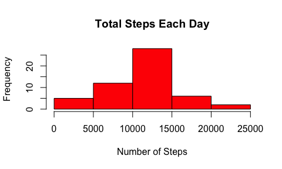
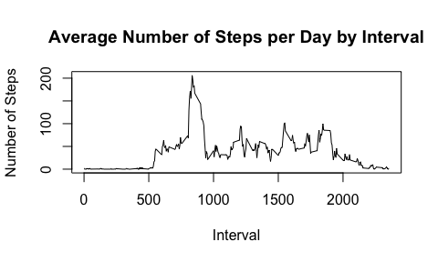
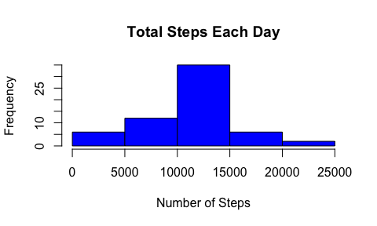
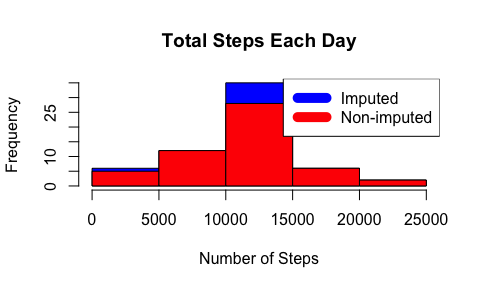
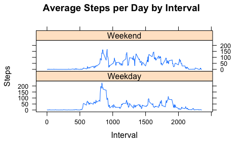

# PA1_template
April 21, 2016  


Libaries Used


```r
library(readr)
library(tidyr)
library(dplyr)
```

```
## 
## Attaching package: 'dplyr'
```

```
## The following objects are masked from 'package:stats':
## 
##     filter, lag
```

```
## The following objects are masked from 'package:base':
## 
##     intersect, setdiff, setequal, union
```

```r
library(ggplot2)
```

# 1. Code to load data into data frame. 


```r
temp <- tempfile()
download.file("https://d396qusza40orc.cloudfront.net/repdata%2Fdata%2Factivity.zip",temp)
dataFile <- unz(temp,"activity.csv")
activity <- read_csv(dataFile,)
unlink(temp)
```

# 2. Histogram of the total number of steps taken each day


```r
steps_by_day <- aggregate(steps ~ date, activity, sum)
hist(steps_by_day$steps, main = paste("Total Steps Each Day"), col="red", xlab="Number of Steps")
```



# 3. Mean and median number of steps taken each day


```r
rmean <- mean(steps_by_day$steps)
paste("Mean steps per Day =", rmean)
```

```
## [1] "Mean steps per Day = 10766.1886792453"
```

```r
rmedian <- median(steps_by_day$steps)
paste("Meadian steps per day= ", rmedian)
```

```
## [1] "Meadian steps per day=  10765"
```

# 4. Time series plot of the average number of steps taken


```r
steps_by_interval <- aggregate(steps ~ interval, activity, mean)
plot(steps_by_interval$interval,steps_by_interval$steps, type="l", 
        xlab="Interval", ylab="Number of Steps",
        main="Average Number of Steps per Day by Interval")
```



# 5. The 5-minute interval that, on average, contains the maximum number of steps


```r
max_interval <- steps_by_interval[which.max(steps_by_interval$steps),1]
paste("The tnterval that contains the maximum number of steps is", max_interval)
```

```
## [1] "The tnterval that contains the maximum number of steps is 835"
```

# 6. Code to describe and show a strategy for imputing missing data

Code to show the total # of missing values.


```r
paste("The total number of missing values in the dataset is", sum(is.na(activity$steps)))
```

```
## [1] "The total number of missing values in the dataset is 2304"
```

Missing values were imputed by inserting the average for each interval.


```r
 imputed_data <- transform(activity, steps = ifelse(is.na(activity$steps), steps_by_interval$steps[match(activity$interval, steps_by_interval$interval)], activity$steps))
```

Zeroes were imputed for 10-01-2012 because steps for the first day would have been much higher than the following day.


```r
imputed_data[as.character(imputed_data$date) == "2012-10-01", 1] <- 0
```

# 7. Histogram of the total number of steps taken each day after missing values are imputed.


```r
 steps_by_day_i <- aggregate(steps ~ date, imputed_data, sum)
hist(steps_by_day_i$steps, main = paste("Total Steps Each Day"), col="blue", xlab="Number of Steps")
```



Calculate difference between imputed and non-imputed data mean and median.


```r
rmean.i <- mean(steps_by_day_i$steps)
rmedian.i <- median(steps_by_day_i$steps)
mean_diff <- rmean.i - rmean
med_diff <- rmedian.i - rmedian
total_diff <- sum(steps_by_day_i$steps) - sum(steps_by_day$steps)
```
  

Create Histogram to show difference between imputed and non-imputed. 


```r
 steps_by_day_i <- aggregate(steps ~ date, imputed_data, sum)
hist(steps_by_day_i$steps, main = paste("Total Steps Each Day"), col="blue", xlab="Number of Steps")
hist(steps_by_day$steps, main = paste("Total Steps Each Day"), col="red", xlab="Number of Steps", add=T)
legend("topright", c("Imputed", "Non-imputed"), col=c("blue", "red"), lwd=10)
```



# 8. Panel plot comparing the average number of steps taken per 5-minute interval across weekdays and weekends


```r
weekdays <- c("Monday", "Tuesday", "Wednesday", "Thursday", "Friday")
imputed_data$dow = as.factor(ifelse(is.element(weekdays(as.Date(imputed_data$date)),weekdays), "Weekday", "Weekend"))
  
steps_by_interval_i <- aggregate(steps ~ interval + dow, imputed_data, mean)
  
library(lattice)
  
xyplot(steps_by_interval_i$steps ~ steps_by_interval_i$interval|steps_by_interval_i$dow, main="Average Steps per Day by Interval",xlab="Interval", ylab="Steps",layout=c(1,2), type="l")
```



